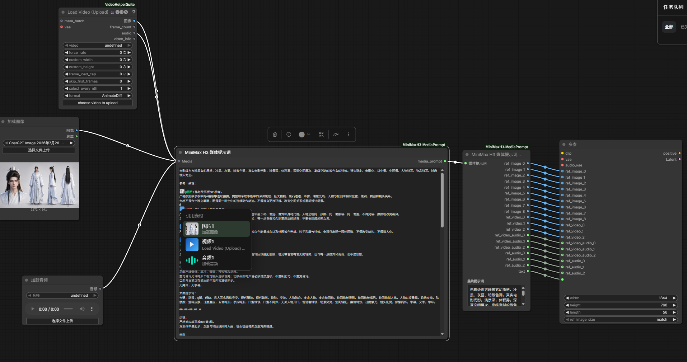

# ComfyUI-MiniMaxH3-MediaPrompt

[中文说明](README_CN.md)

A ComfyUI plugin created for `MiniMaxH3ReferenceToVideo`. It makes MiniMax image, video, audio, and dialogue references faster to add and easier to manage in a prompt.

## Features

- Dynamically add reference images, videos, and audio without manually managing numbered inputs.
- Choose `Load video` to connect both video and audio, or `Load video only` to omit the soundtrack.
- Type `@` in the prompt editor to select any connected media.
- Automatically convert media mentions into the MiniMax prompt syntax: `<Picture N>`, `<Video N>`, and `<Audio N>`.
- Type `#` to create an editable dialogue block, which is converted into `<d>...</d>` for MiniMax.
- Preview the final converted prompt after running the workflow.

## Workflow

1. Add or connect image, video, and audio loader nodes to the `Media` input.
2. Type `@` in the prompt editor and select the media you want to reference.
3. Type `#` when you need a dialogue block, then enter the dialogue inside it.
4. Connect `MiniMax H3 Media Prompt Output` to `MiniMaxH3ReferenceToVideo`.
5. Run the workflow. The plugin converts all media mentions and dialogue blocks into the syntax required by MiniMax.



## Video Settings Node

The `MiniMax H3 Video Settings` node keeps the two-stage video generation parameters together:

- Video duration in seconds: defaults to `10`.
- Frame rate: integer input; defaults to `24`.
- Aspect ratio: supports `1:1`, `2:3`, `3:2`, `3:4`, `4:3`, `9:16`, `16:9`, and `21:9`; defaults to `16:9`.
- First resolution: supports all 14 presets below; defaults to `480P`.
- Second resolution: supports all 14 presets below; defaults to `720P`.
- First/second steps: default to `6` and `2` respectively.
- LoRA strength: defaults to `0.75`.

The node outputs the video frame length, width and height for both stages, both step counts, the LoRA strength, and the frame rate as a `FLOAT`. Frame length is calculated as `max(5, round(a * fps)) + (5 - (max(5, round(a * fps)) % 17)) % 17`, where `a` is the input duration in seconds and `fps` is the integer frame-rate input. The defaults of `10` seconds and `24 FPS` output `243` frames and a frame-rate value of `24.0`. Dimensions are calculated from the selected aspect ratio and target pixel count, then aligned to multiples of `32`. At the default `16:9` aspect, the first stage is `864 x 480` and the second stage is `1280 x 736`.

| Resolution preset | 16:9 base output |
|---|---|
| 360P | 608 x 352 |
| 416P | 736 x 416 |
| 480P | 864 x 480 |
| 540P | 960 x 544 |
| 608P | 1056 x 608 |
| 640P | 1152 x 640 |
| 672P | 1216 x 672 |
| 720P | 1280 x 736 |
| 768P (1344x768) | 1344 x 768 |
| 768P (1376x768) | 1376 x 768 |
| 832P | 1504 x 832 |
| 928P | 1664 x 928 |
| 1024P | 1824 x 1024 |
| 1080P | 1920 x 1088 |

## Installation

Clone the repository into `ComfyUI/custom_nodes`, then restart ComfyUI:

```bash
cd ComfyUI/custom_nodes
git clone https://github.com/YingsenP/ComfyUI-MiniMaxH3-MediaPrompt.git
```

## Video Dependency

Quickly adding a reference video uses the `Load Video (Upload)` node from [ComfyUI-VideoHelperSuite](https://github.com/kosinkadink/ComfyUI-VideoHelperSuite). Install it before using video references.

Do not connect the optional `VAE` input on `Load Video (Upload)`. MiniMax reference videos require `IMAGE` frame batches rather than `LATENT` values.

